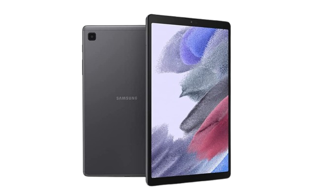
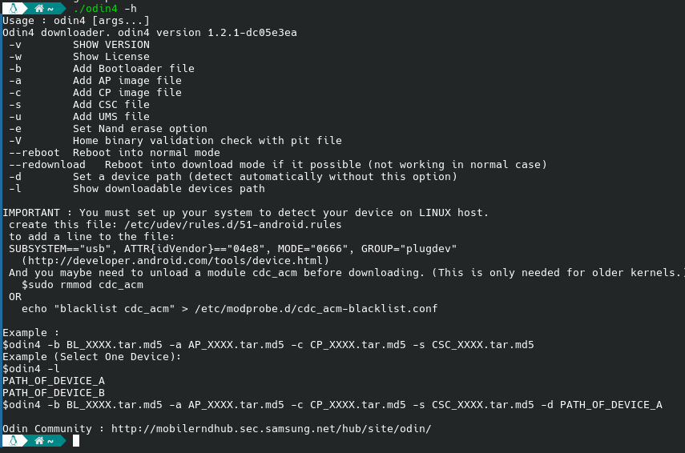
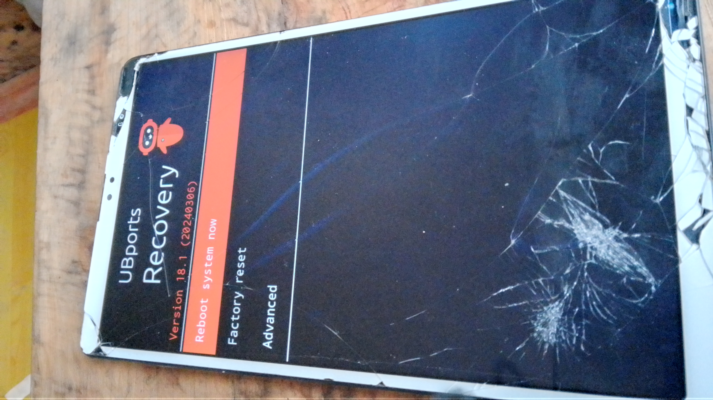

#  
# BASED ON UBPORTS LENOVO M10 HD GEN 2 


# Samsung Galaxy Tab A7 Lite 

<div align="center">
  


**Samsung Galaxy Tab A7 Lite (gta7lite/gta7litewifi)**

[](https://ubuntu.com)
[](https://github.com)

</div>

---


---

##  Device Specifications

### Samsung Galaxy Tab A7 Lite (gta7lite)

| Component | Specification |
|-----------|--------------|
| **Chipset** | Mediatek MT6765/MT8768 Helio P22T |
| **GPU** | PowerVR GE8320 |
| **RAM** | 2/3/4 GB |
| **Storage** | 32/64 GB |
| **Card Slot** | microSD |
| **SIM** | Nano-SIM (GSM / HSPA / LTE) |
| **Battery** | Li-Po 5100 mAh (non-removable) |
| **Display** | 8.7" TFT LCD, 800x1340 pixels |
| **Rear Camera** | 2 MP |
| **Front Camera** | 0.8 MP |
| **OS (Shipped)** | Android 11 (Latest: Android 14) |
| **Kernel** | 4.19.191 |

---

##  Feature Status

### Ubuntu 24.04 - 
(Booting but device failed to start LightDM)
| Feature | Status | Feature | Status |
|---------|--------|---------|--------|
| Recovery | ✅ Working | Boot | ✅ Working |
| SSH | ❌ Not Working | Bluetooth | ❌ Not Working |
| Charge | ❌ Not Working | Camera | ❌ Not Working |
| GPU | ❌ Not Working | GPS | ❌ Not Working |
| | | Audio | ❌ Not Working |
| | | Bluetooth Audio | ❌ Not Working |
| | | Waydroid | ❌ Not Working |
| | | MTP | ❌ Not Working |
| | | ADB | ❌ Not Working |
| | | WiFi | ❌ Not Working |
| | | SD Card | ❌ Not Working |
| | | Wireless Display | ❌ Not Working |
| | | Manual Brightness | ❌ Not Working |
| | | Double Tap to Wake | ❌ Not Working |
| | | Hardware Video | ❌ Not Working |
| | | Rotation | ❌ Not Working |
| | | Proximity Sensor | ❌ Not Working |
| | | Virtualization | ❌ Not Working |
| | | Light Sensor | ❌ Not Working |
| | | Auto Brightness | ❌ Not Working |
| | | Hotspot | ❌ Not Working |
| | | Airplane Mode | ❌ Not Working |

---

## ⚠️ Prerequisites 

### Required Firmware

> **Important:** Stock firmware is required before installing Ubuntu Touch.
**Download Links:**
- 📦 [UNlock bootloader and install TWRP : IDK , find in xda , im get blocked that website from my country
- 🔧 [(Odin4)](https://github.com/Adrilaw/OdinV4) - Download for your system

### Required Files

idk updatelater
### Flashing Firmware

1. Extract the `your file` archive
2. Run Odin4 flash tool: 
   ```bash
   ./odin4 -a YOUR/AP/FILE/PATH
   ```




---

## 🔓 Unlock Bootloader

### Step 1: Download MTK Client

```bash
git clone https://github.com/bkerler/mtkclient
cd mtkclient
```

### Step 2: Erase Partitions

**Turn off your device**, then run:

```bash
mtk e metadata,userdata,md_udc
```

### Step 3: Unlock Bootloader

```bash
mtk da seccfg unlock
```

Connect your device to the computer and wait for the process to complete.

> **Note:** You can also find video tutorials on YouTube by searching "unlock bootloader Samsung"

✅ **Your device bootloader is now unlocked!**

---

## 📥 Installation Guide

### Step 1: Build Ubuntu Touch 

```bash
./build.sh
```
after this run
```bash

 cp gta7litewifi.dtb workdir/downloads/KERNEL_OBJ/arch/arm64/boot/dts/gta7litewifi.dtb     
 ```
now run  

```bash
./build.sh
```
```bash

 ./build/prepare-fake-ota.sh out/device_gta7litewifi_usrmerge.tar.xz ota   
```

```bash
./build/system-image-from-ota.sh ota/ubuntu_command images
```


### Step 2: Flash Boot Image

```bash
fastboot flash boot images/boot.img
```


### Step 3: Flash Recovery

1. Flash recovery:
find in release link
```bash
wget https://github.com/dev686868/UBports-gta7litewifi/releases/download/2/recovery.img
```

```bash
fastboot flash revovery recovery.img
```

### Step 4: Enter Recovery Mode

Hold **VOLUME UP + POWER BUTTON** simultaneously until you enter RECOVERY mode.


### Step 5: Enter Fastboot Mode

go Advanded > Enter fastboot


**UBports recovery on Samsung Galaxy Tab A7 Lite (gta7lite/gta7litewifi)**


### Step 6: Flash VBMeta

1. Flash with verification disabled:
   ```bash
   fastboot --disable-verity --disable-verification flash vbmeta vbmeta.img
   ```

### Step 7: Flash Custom Logo (Optional)

```bash
fastboot flash logo logo.bin
```

### Step 8: Format Userdata

> **Note:** Requires fastboot binary version 30.0.0-6374843 or higher

```bash
fastboot format:ext4 userdata
```

### Step 9: Delete Product Partition

```bash
fastboot delete-logical-partition product
```

### Step 10: install System

```bash
fastboot flash system images/rootfs.img
```

### Step 11: copy Rootfs (i will fix path to /system_root after boot sucessfully)


```bash
mkdir /data/system-data/
```

```bash
cp -a /system_root/* /data/system-data/
```


### Step 12: Reboot

```bash
fastboot reboot
```

# YAYS, you just install Ubuntu touch on this tablet 
(While the device is completing its port and flashing can be done, it is still in a very early stage of development.)


command to get ssh (init shell)
```bash
while true; do
    INTERFACE=$(ip -br link show | grep -E 'enp|usb' | awk '{print $1}' | head -n 1)
    
    if [ -n "$INTERFACE" ]; then
        echo "Found interface: $INTERFACE. Setting IP..."
        sudo ip addr add 192.168.2.1/24 dev $INTERFACE 2>/dev/null
        sudo ip link set $INTERFACE up
        
        echo "Trying to connect to Halium..."
        nc -v -w 2 192.168.2.15 23
    fi
    sleep 0.5
done
```
# (debug yourself for boot and if you sucess to boot, please pull request that project to this repo and when device can boot i will push it to UBports Gitlab)
# THANKS FOR READING!!!


