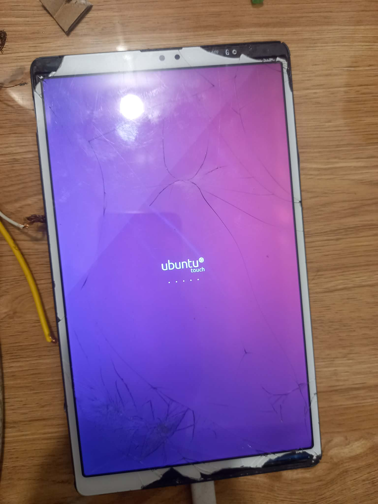

# Ubuntu Touch for Samsung Galaxy Tab A7 Lite (gta7litewifi)

This repository contains the device-specific configuration files to port Ubuntu Touch to the Samsung Galaxy Tab A7 Lite.
## Device Specifications

### Samsung Galaxy Tab A7 Lite (gta7lite)

| Component | Specification |
|-----------|--------------|
| **Chipset** | Mediatek MT6765/MT8768 Helio P22T |
| **GPU** | PowerVR GE8320 |
| **RAM** | 2/3/4 GB |
| **Storage** | 32/64 GB |
| **Card Slot** | microSD |
| **SIM** | Nano-SIM (GSM / HSPA / LTE) |
| **Battery** | Li-Po 5100 mAh (non-removable) |
| **Display** | 8.7" TFT LCD, 800x1340 pixels |
| **Rear Camera** | 2 MP |
| **Front Camera** | 0.8 MP |
| **OS (Shipped)** | Android 11 (Latest: Android 14) |
| **Kernel** | 4.19.191 |

---

## Current Status

**Current Stage:** Work in Progress (almost finished, stuck in Logo)




 ## 🔓 Unlock Bootloader


> **Note:** find video tutorials on YouTube by searching "unlock bootloader Samsung"

✅ **Your device bootloader is now unlocked!**

---

## 📥 Installation Guide 

### !!!install Custom recovery before it!!!
### Step 1: Build Ubuntu Touch 

```bash
./build.sh
```

```bash

 ./build/prepare-fake-ota.sh out/device_gta7litewifi_usrmerge.tar.xz ota   
```

```bash
./build/system-image-from-ota.sh ota/ubuntu_command images
```


### Step 2: Flash Boot Image

```bash
fastboot flash boot images/boot.img
```


### Step 3: Flash Recovery (Optional , you can use twrp ,íts better)


```bash
fastboot flash revovery recovery.img
```

### Step 4: Enter Recovery Mode

Hold **VOLUME UP + POWER BUTTON** simultaneously until you enter RECOVERY mode.


### Step 5: Enter Fastboot Mode

go Advanded > Enter fastboot


**UBports recovery on Samsung Galaxy Tab A7 Lite (gta7lite/gta7litewifi)**


### Step 6: Flash VBMeta

1. Flash with verification disabled:
   ```bash
   fastboot --disable-verity --disable-verification flash vbmeta vbmeta.img
   ```

### Step 7: Flash Custom Logo (Optional)

```bash
fastboot flash logo logo.bin
```

### Step 8: Format Userdata


```bash
fastboot format:ext4 userdata
```
> **Note:** or select format data partition in UBports recovery 


### Step 9: Delete Product Partition

```bash
fastboot delete-logical-partition product
```

### Step 10: install System

```bash
fastboot flash system images/rootfs.img
```


### Step 11: Reboot

```bash
fastboot reboot
```
